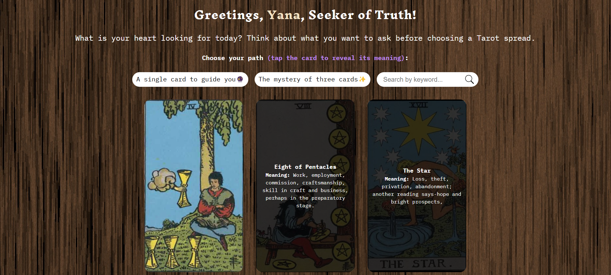

# Vanilla JS TarotMystic App



A simple and interactive Tarot Card reading app built with **Vanilla JavaScript**, powered by the [Tarot API](https://tarotapi.dev).

## 🔮 Live Demo

Uncover your fortune with a click: 👉 [Tarot Mystic App Demo](https://yanaesher.github.io/TarotMystic/client)

## _Features include_

- ✨ Single-card prediction
- 🔮 Classic three-card spread
- 🔍 Keyword-based card search

## Code structure

```text
📁 TarotMystic                       # Root directory of the project
└── client                            # Client-side application
    ├── index.html                   # Main entry HTML file
    ├── public/                       # Static assets folder
    │   └── tarocards/                # Contains tarot card images
    └── src/                          # Source code
        ├── pages/                    # Page modules for routing
        ├── utils/                    # Utility functions (e.g., API calls, helpers)
        ├── views/                    # UI components and views
        ├── app.js                    # Initializes and runs the application
        ├── constants.js              # Stores constants (e.g., base URLs, API keys)
        └── data.js                   # Model file containing data handling logic

```

## Setup Instructions

To run this project locally, follow these steps:

### 1. Clone the Repository

First, clone the project to your local machine by running:

```bash
git clone https://github.com/yanaesher/TarotMystic
```

### 2. Navigate to the Project Folder

Now, move into the folder containing the project files:

```bash
cd TarotMystic
```

This will place you inside the TarotMystic directory.

### 3. Install Dependencies _(optional)_

Next, you need to install the necessary packages that the app depends on. Run this command:

```bash
npm install
```

This will download and install for the app live-server client, which is used to serve the app locally in your browser.

### 4. Start the App (if step 3 was completed)

Finally, you’re ready to run the app! Start the development server with this command:

```bash
npm run start
```

 
